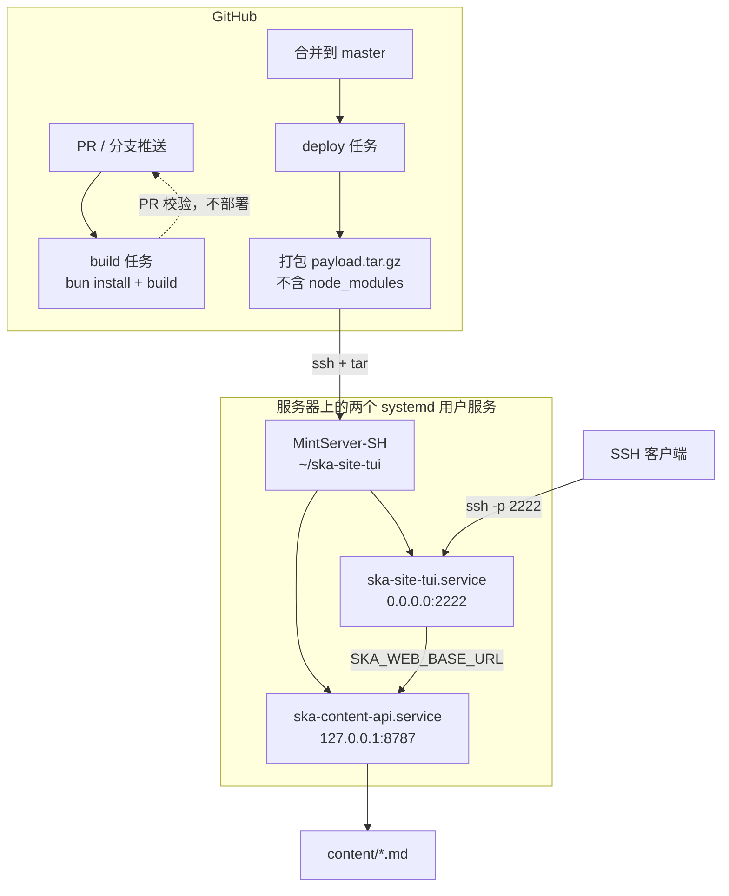

# 部署到 MintServer-SH

面向 `MintServer-SH`（Debian 13 / 腾讯云上海）的部署说明。核心思路是
**CI 构建 → SSH 推送产物 → 服务器只收几百 KB**，日常部署不传依赖。
本文所有命令都经过实机验证。

## 一、为什么是这个方案

目标服务器有两个硬约束，方案是围绕它们设计的：

| 实测项 | 结果 | 影响 |
| --- | --- | --- |
| `github.com:443`（HTTPS） | ❌ 超时（12s 无响应） | 不能用 `git clone https://`；`curl bun.sh \| bash` 也会失败 |
| `github.com:22`（SSH） | ✅ 通 | GitHub Actions 推送到服务器不受影响 |
| `registry.npmjs.org` / `registry.npmmirror.com` | ✅ 通（~15MB/s） | 依赖走 npm 源，Bun 走 npmmirror |
| `gh-proxy.com` 等 GitHub 代理 | ✅ 通 | tree-sitter 语法资产从这里取 |

另外服务器上**没有 rsync、没有 git、没有 node**，只有 `curl` / `tar` / `unzip` /
`python3`，所以传输用 `tar | ssh`，装 Bun 用 npmmirror 的预编译包。

## 二、架构



**每次部署的传输量**：

| 内容 | 大小 | 频率 |
| --- | --- | --- |
| `dist/index.js` | ~1.3 MB | 每次 |
| `content/` `scripts/` `deploy/` `tools/` | 几十 KB | 每次 |
| `node_modules/` | ~182 MB | **仅 `bun.lock` 变化时**（在服务器上就地安装，不走 CI 传输） |

## 三、首次部署

### 3.1 本地准备一次：把新文件提交上去

`content/`、`deploy/`、`scripts/`、`tools/` 之前没有纳入版本管理，
服务器 clone/解包时会缺文件，必须先提交：

```bash
git add content deploy scripts tools docs .env.example .gitignore \
        Dockerfile package.json .github/workflows/deploy.yml src/
git commit -m "feat: 本地内容源 + 部署脚本 + CI 部署流水线"
git push origin master
```

### 3.2 服务器初始化

```bash
# 从本地推一份脚本过去（服务器上还没有仓库）
scp -r scripts MintServer-SH:~/ska-site-tui/

# 先体检，不动任何东西
ssh MintServer-SH 'cd ~/ska-site-tui && ./scripts/provision.sh --check'

# 正式初始化：装 Bun、建目录、注册 systemd 服务
ssh MintServer-SH 'mkdir -p ~/ska-site-tui && cd ~/ska-site-tui && ./scripts/provision.sh'
```

### 3.3 开 linger（需要 root 密码，只能你手动做）

不开启的话，**断开 SSH 后服务会被 systemd 停掉**：

```bash
ssh MintServer-SH
sudo loginctl enable-linger mint
```

顺手修掉 `sudo` 每次报的 `unable to resolve host`：

```bash
sudo sed -i "s/^127\.0\.0\.1.*/& $(hostname)/" /etc/hosts
```

### 3.4 第一次部署

本地跑一次和 CI 相同的流程即可（也可以直接在 GitHub 上点
`Actions → Deploy → Run workflow`）：

```bash
cd /path/to/ska-site-tui
bun install --frozen-lockfile && bun run build

mkdir -p build && cp -r dist content tools deploy scripts \
  package.json bun.lock tsconfig.json build.ts bunfig.toml .env.example build/
git rev-parse --short HEAD > build/REVISION
tar czf payload.tar.gz -C build .

ssh MintServer-SH 'mkdir -p ~/ska-site-tui/.incoming'
cat payload.tar.gz | ssh MintServer-SH 'cat > ~/ska-site-tui/.incoming/payload.tar.gz'

ssh MintServer-SH
cd ~/ska-site-tui
tar xzf .incoming/payload.tar.gz ./scripts/
bash scripts/deploy.sh --payload .incoming/payload.tar.gz
```

首次会在服务器上安装依赖（182 MB，实测下载约 2.4 秒）。
这一步会自动从 `.env.example` 生成一份 `.env`，并**打印需要你检查的字段**。

### 3.5 检查 `.env`

```bash
ssh MintServer-SH
cd ~/ska-site-tui
vi .env
```

重点确认这四行：

```ini
SKA_WEB_BASE_URL=http://127.0.0.1:8787   # 指向本机内容 API
CONTENT_API_PORT=8787
GH_PROXY=https://gh-proxy.com/           # ← 墙内服务器必须填，否则代码块高亮失效
AI_API_KEY=sk-xxxx                       # 不填则自动禁用 AI 对话
```

> `GH_PROXY` 是最容易被忽略的一项。`src/theme/parsers-config.ts` 里 34 个语言的
> 语法高亮 wasm 默认从 `github.com` 下载，在这台服务器上会 12 秒超时。
> 填上代理后实测 85 个资产 URL **全部 200**。

改完重启：

```bash
systemctl --user restart ska-site-tui ska-content-api
```

### 3.6 配 GitHub Secrets

服务器上生成一把**只用于这套 CI 的独立密钥**（不要复用你自己登录用的密钥）：

```bash
ssh MintServer-SH 'ssh-keygen -t ed25519 -f ~/.ssh/gha_deploy -N "" -C "gha-deploy"'
ssh MintServer-SH 'cat ~/.ssh/gha_deploy.pub >> ~/.ssh/authorized_keys'
ssh MintServer-SH 'cat ~/.ssh/gha_deploy'   # ← 私钥，填进下面的 secret
```

在仓库 `Settings → Secrets and variables → Actions` 添加：

| Secret | 值 | 必填 |
| --- | --- | --- |
| `DEPLOY_SSH_KEY` | 上面打印的私钥全文 | ✅ |
| `DEPLOY_HOST` | `111.229.10.239` | ✅ |
| `DEPLOY_USER` | `mint` | ✅ |
| `DEPLOY_PORT` | `1324` | ✅ |
| `DEPLOY_KNOWN_HOSTS` | 见下方命令输出 | 建议 |

`DEPLOY_KNOWN_HOSTS` 用来防止中间人攻击。在**可信网络**下采集一次：

```bash
ssh-keyscan -p 1324 -H 111.229.10.239
```

不配的话 workflow 会退化成每次现场 `ssh-keyscan`（可用，但首次连接理论上可被劫持）。

配置完就可以 `git push` 测试了。

## 四、日常协作流程

| 角色 | 改什么 | 流程 | 上线耗时 |
| --- | --- | --- | --- |
| 写文章 | `content/posts/*.md`、`content/notes/*.md` | GitHub 网页 `Add file → Create new file` → 提 PR → 合并 | ~1 分钟（构建 + 替换 content/ + 重启） |
| 改代码 | `src/**` | 本地分支 → PR（CI 会跑构建校验）→ 合并 | ~2 分钟 |
| 改服务/脚本 | `deploy/**`、`scripts/**` | 同上 | ~1 分钟 |
| 改配置 | `.env.example` | 提 PR；线上 `.env` 由 owner 在服务器手动改 | 手动 |

写文章时只要文件名就是 slug，frontmatter 格式见
[local-content.md](./local-content.md)：

```markdown
---
title: 标题
date: 2026-09-25
tags: [标签A, 标签B]
excerpt: 列表里显示的摘要，省略则自动取正文首段
---

正文从这里开始。
```

**合并到 master 即上线**，不需要任何人手动操作。

### 分支保护建议

`Settings → Branches → Add rule`，保护 `master`：

- ✅ Require a pull request before merging
- ✅ Require status checks to pass → 选 `构建校验`
- ✅ Require conversation resolution before merging

不要求审批的话，小团队做到「CI 必须过」就够挡住绝大多数事故了。

## 五、手动运维

服务器上 `~/ska-site-tui/scripts/` 下：

```bash
./scripts/deploy.sh --status     # 看状态、端口、当前部署的 commit
./scripts/deploy.sh              # 用服务器上的源码重建并重启
./scripts/deploy.sh --rollback   # 回滚到上一次成功部署的 dist/
./scripts/provision.sh --check   # 环境体检
./scripts/ska.sh logs            # 跟踪日志
./scripts/ska.sh refresh         # 清内容缓存并重启
```

内容改动**不需要重启**：`.env` 里 `CONTENT_CACHE_TTL_MS=5000` 让目录缓存 5 秒过期。
缓存策略是「先给旧数据再后台刷新」，所以存盘后第一次连接可能是旧列表，第二次就对。

## 六、排查

### 列表显示 0 篇

```bash
curl -s http://127.0.0.1:8787/ | head        # 看 counts
systemctl --user status ska-content-api      # 服务是否在跑
ls ~/ska-site-tui/content/posts/             # 文章是否同步上来
```

### 部署后服务没起来

```bash
systemctl --user status ska-site-tui --no-pager -n 40
journalctl --user -u ska-site-tui -f
```

`deploy.sh` 在健康检查失败时会自动打印最近 25 行日志。

### 服务自己停了（断开 SSH 之后）

linger 没开。`loginctl show-user mint -p Linger` 应为 `yes`。

### 代码块没有语法高亮

`GH_PROXY` 没配或代理挂了。验证：

```bash
grep GH_PROXY ~/ska-site-tui/.env
curl -o /dev/null -w '%{http_code}\n' --max-time 20 \
  "https://gh-proxy.com/https://github.com/tree-sitter/tree-sitter-json/releases/download/v0.24.8/tree-sitter-json.wasm"
```

返回 `200` 就正常。资源会被缓存到 `~/.local/share/opentui/tree-sitter/`，只下第一次。

### 装了 Bun 但 `ska.sh` 说找不到

`scripts/ska.sh` 硬编码 `$HOME/.bun/bin/bun`。如果你装在别处：

```bash
export BUN_BIN=/path/to/bun        # deploy.sh 认这个变量
ln -s /path/to/bun ~/.bun/bin/bun  # ska.sh 认这个路径
```

### 端口被占用

```bash
ss -tlnp | grep -E ':(2222|8787)'
```

## 七、其它部署方式

### Docker（备选）

仓库里有 `Dockerfile` 和 `docker-compose.yml`，tag `v*.*.*` 会推送到 GHCR。
服务器上**没有装 Docker**（只有 1.9 GB 内存，跑 Docker 会明显吃紧），
要用的话：

```bash
# 需要 root
curl -fsSL https://get.docker.com | sh
usermod -aG docker mint
```

注意 `Dockerfile` 里 `SKA_WEB_BASE_URL` 需要指向外部 ska-web 站点
（容器内没有 `content-api` 进程），所以 Docker 路线不适合本仓库的
「本地 markdown 内容源」用法。

### Bun 单文件编译（不推荐）

实测 `bun build --compile` 能产出 115 MB 的自包含可执行文件（`.so` 已内嵌），
好处是服务器**完全不用装 Bun 和依赖**。但有两个坑：

1. tree-sitter worker 在编译模式下找不到入口，需要额外设
   `OTUI_TREE_SITTER_WORKER_PATH` 指向外部 `parser.worker.js`；
2. 每次部署要传 115 MB，比现在的 ~1.5 MB 慢两个数量级。

所以只在「服务器完全无法安装 Bun」时才考虑。
